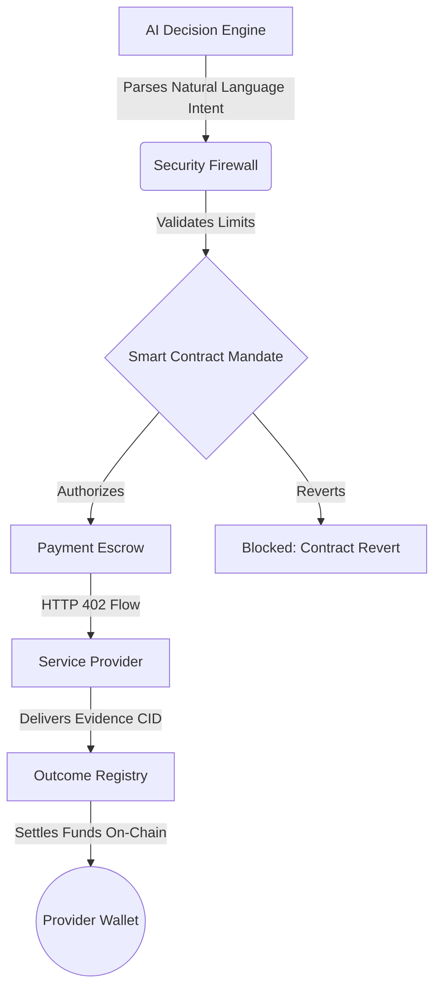

# ProofPay - Web3 AI Agentic Platform 

[](#) [](https://opensource.org/licenses/MIT)

ProofPay is a state-of-the-art **Economic Security Firewall** and **Decentralized Escrow** platform designed to let AI agents safely and autonomously purchase digital services on the internet.

## The Problem
AI agents can autonomously reason and trigger API calls, but giving an AI agent direct access to a credit card or a cryptocurrency wallet is extremely dangerous. Without strict boundaries, agents can:
- Overspend due to a hallucinated instruction or prompt injection.
- Be overcharged by malicious service providers.
- Pay for services that were never actually delivered.

## The Solution: ProofPay Architecture
ProofPay solves this by separating **Intent** from **Execution** and **Enforcement**.



## How It Works

### 1. Intent Parsing via LLM
When a user gives an agent a task (e.g., *"Summarize this attached PDF"*), ProofPay uses **Google Gemini** to parse the natural language intent and map it to an exact registered Service Type (e.g., `summarization`, `ocr`, `translation`).

### 2. Provider Selection Engine
The AI Agent doesn't just pick the cheapest provider. It evaluates a dynamic list of decentralized providers based on:
- **Price** (Cost per execution)
- **Quality** (Historical accuracy score)
- **Reliability** (Uptime and latency)

*Example: The agent might choose `SummaryAI` because it offers 95% quality at $0.30, rejecting a cheaper but less reliable provider.*

### 3. Smart Contract Mandates
Instead of giving the agent unlimited funds, human owners deploy **On-Chain Agent Mandates** on the Sepolia network. These mandates enforce:
- Maximum Total Budget
- Daily Spend Limits
- Per-Transaction Ceilings
- Allowed Services (e.g., restricted to `summarization` only)

### 4. The HTTP 402 Escrow Flow
Before a provider performs heavy compute, they return an **HTTP 402 Payment Required** status. ProofPay's backend catches this, validates it against the firewall, and locks the exact requested funds into the `PaymentEscrow` smart contract.

### 5. Delivery & Outcome Verification
Once the funds are escrowed, the provider executes the service. They must return the result along with **IPFS Evidence (Pinata CID)**. The `OutcomeRegistry` smart contract records the result hash and IPFS CID, ensuring immutable proof of delivery before the funds are finally settled to the provider's wallet.

---

## Technical Stack
- **Frontend**: Next.js (App Router), React, Tailwind CSS, Framer Motion
- **Backend**: Next.js Route Handlers, Prisma (PostgreSQL), Google Gen AI (Gemini)
- **Blockchain**: Hardhat, Ethers.js v6, Solidity (Sepolia Testnet)
- **Storage**: Pinata (IPFS)
- **UI Components**: shadcn/ui, Lucide React

## Getting Started

First, install dependencies:
```bash
npm install
```

Start your local Hardhat node (in a new terminal):
```bash
npx hardhat node
```

Run smart contract tests:
```bash
npm run contracts:test
```

Start the development server:
```bash
npm run dev
```

Open [http://localhost:3000](http://localhost:3000) with your browser to see the result.

## Smart Contracts

The core logic is divided into three on-chain components:
1. **AgentMandate.sol**: Manages spending limits, daily budgets, and service whitelists.
2. **PaymentEscrow.sol**: Locks funds on-chain while waiting for provider delivery.
3. **OutcomeRegistry.sol**: Immutable ledger of cryptographic hashes and IPFS CIDs proving the work was done.

*All transactions use standard native ETH (or Sepolia ETH on testnet), scaled to `mwei` micro-transactions to prevent faucet depletion during testing.*
